# Hallu! 👋          
I'm Tue Dinh, a first-year master student at Aalto University. I'm interested in **AI, IoT, Signal Processing and HealthCare field**. I work on projects that combine **AI, Embedded Systems, Machine Learning, and Signal Processing**.   

---

## 📊 GitHub Stats And 🔥 Most Used Languages:

---

## 🌍 Connect with me:

